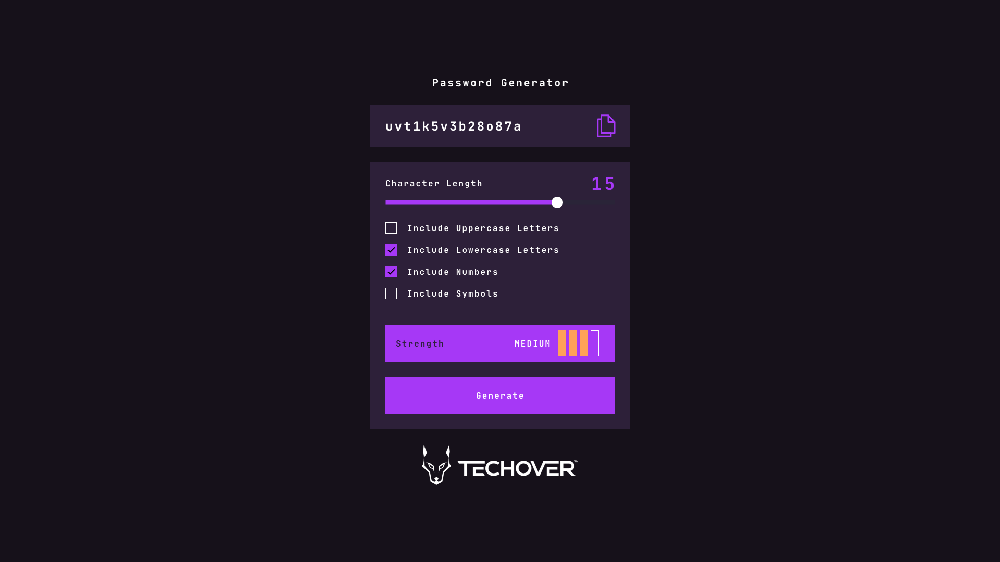

## Lösenords Generator

**Dags för utmaning 🐺**

## Vad ska du göra?

Din utmaning är att bygga ut denna lösenordsgeneratorapp och få den att se så lik designen som möjligt.

Du kan använda vilka verktyg du vill för att hjälpa dig att slutföra utmaningen. Så om du har något du vill öva på, känn dig fri att prova det.
Ex. TypeScript, React, sass 🔥

**Dina användare bör kunna**:

- Generera ett lösenord baserat på de valda inklusionsalternativen
- Kopiera det genererade lösenordet till datorns urklipp
- Se en styrkebedömning för sitt genererade lösenord
- Visa den optimala layouten för gränssnittet beroende på sin enhets skärmstorlek
- Se hover- och fokustillstånd för alla interaktiva element på sidan

## Steg-För-Steg Guide!

1. Börja med att skapa en grundläggande HTML-sida med kortet som användaren ska kunna välja sina lösenordsinställningar.

2. En slider för att välja antalet tecken i lösenordet

3. Checkboxes för att välja vilka tecken som ska ingå i lösenordet (stora bokstäver, små bokstäver, siffror, specialtecken)

4. En "styrke-mätare" för att kunna se hur stark ditt lösenord är.
5. En knapp för att generera lösenordet.

6. Använd CSS för att styla formuläret och göra det mer användarvänligt. Använd CSS för att efterlikna layout, färger, typsnitt och padding.

7. Skapa en funktion i JavaScript för att generera lösenordet baserat på användarens val. Använda dessa för att generera ett slumpmässigt lösenord.

8. Skapa en annan funktion i JavaScript för att kopiera det genererade lösenordet till användarens urklipp.

9. Skapa en funktion i JavaScript för att beräkna styrkan på det genererade lösenordet. Denna funktion kan använda en algoritm som tar hänsyn till faktorer som längd och antal unika användningsval.

10. Använd JavaScript för att uppdatera gränssnittet med det genererade lösenordet och dess styrkebedömning.

11. Lägg till hover- och fokustillstånd för alla interaktiva element på sidan

12. Testa och felsök din lösenordsgeneratorapp för att säkerställa att allt fungerar som det ska.

## Hur lämnar du in uppgiften?

Släng ihop din HTML / CSS och Javscript fil i en mapp och gör det till en zip fil. Som du sedan lämnar in i denna lektionen på TSM.

## Stort Lycka till :)))
